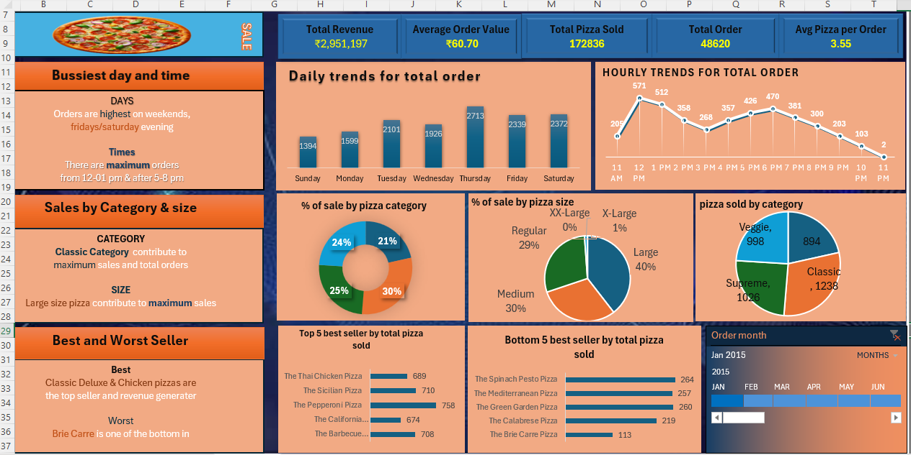

# Dashboard Preview

# Pizza Sales Analysis Dashboard (Excel Project)

## Project Overview

The **Pizza Sales Analysis Dashboard** is an interactive Excel-based business intelligence project designed to analyze pizza sales data.

It provides insights into:

* Total Revenue
* Order Trends (Daily & Hourly)
* Sales by Category & Size
* Best & Worst Sellers
* Customer Ordering Patterns

This dashboard helps business owners make data-driven decisions to improve sales performance and operational efficiency.

---

## Objectives

The main objectives of this project are:

* Analyze overall revenue and order performance
* Identify busiest days and peak hours
* Understand which pizza categories and sizes generate maximum sales
* Identify top-performing and underperforming products
* Provide monthly filtering using slicers

---

## Dashboard Features
### 🔹 KPI Section (Top Summary Cards)

| KPI                 | Value      |
| ------------------- | ---------- |
| Total Revenue       | ₹2,951,197 |
| Average Order Value | ₹60.70     |
| Total Pizzas Sold   | 172,836    |
| Total Orders        | 48,620     |
| Avg Pizza per Order | 3.55       |

These KPIs provide a quick overview of business performance.

---

### 🔹 Daily Trends

Bar chart showing total orders by day:

* Friday has the highest order volume
* Sunday has comparatively lower orders
* Consistent performance across weekdays

---

### 🔹 Hourly Trends

Line chart displaying total orders by hour:

* Major peak at **1 PM**
* Evening peak between **5 PM – 7 PM**
* Lowest orders after **10 PM**

---

### 🔹 Sales by Category

Categories analyzed:

* Classic
* Supreme
* Veggie
* Chicken

Classic category contributes the highest revenue and orders.

---

### 🔹 Sales by Size

Sizes included:

* Small
* Medium
* Large
* X-Large
* XX-Large

Large size pizzas contribute the maximum revenue share.

---

### 🔹 Best & Worst Sellers

#### Top 5 Best Sellers

* The Classic Deluxe Pizza
* The Hawaiian Pizza
* The Pepperoni Pizza
* The Thai Chicken Pizza
* The Barbecue Pizza

#### Bottom 5 Sellers

* The Brie Carre Pizza
* The Spinach Supreme Pizza
* The Mediterranean Pizza
* The Calabrese Pizza
* The Spinach Pesto Pizza

---

### 🔹 Interactive Features

* Month Filter (Slicer)
* Timeline Control
* Pivot Tables
* Pivot Charts
* Dynamic KPI Cards
* Conditional Formatting

---

## Tools & Technologies Used

* Microsoft Excel
* Pivot Tables
* Pivot Charts
* Slicers & Timeline
* Conditional Formatting
* GETPIVOTDATA
* Data Cleaning Techniques

---

## Dataset Description

The dataset includes:

* Order ID
* Order Date
* Order Time
* Pizza Name
* Category
* Size
* Quantity
* Unit Price
* Total Price

---

## Business Insights

1. Focus marketing campaigns on weekends.
2. Increase staffing during peak lunch and evening hours.
3. Promote Large size pizzas (highest sales contributor).
4. Improve visibility of low-selling pizzas or consider menu optimization.
5. Bundle best-selling pizzas for higher average order value.

---

## Learning Outcomes

From this project, I learned:

* Creating dynamic dashboards in Excel
* Advanced Pivot Table techniques
* Business KPI calculation
* Data visualization best practices
* Data-driven decision making

---

## 👨‍💻 Author

**Dilkhush Kumar**
Bachelor of Technology (CSE)
Aspiring Data Analyst / Data Scientist

---

# Conclusion

This Pizza Sales Dashboard provides a complete 360° view of sales performance.
It helps stakeholders understand trends, optimize operations, and increase profitability using data-driven insights.
